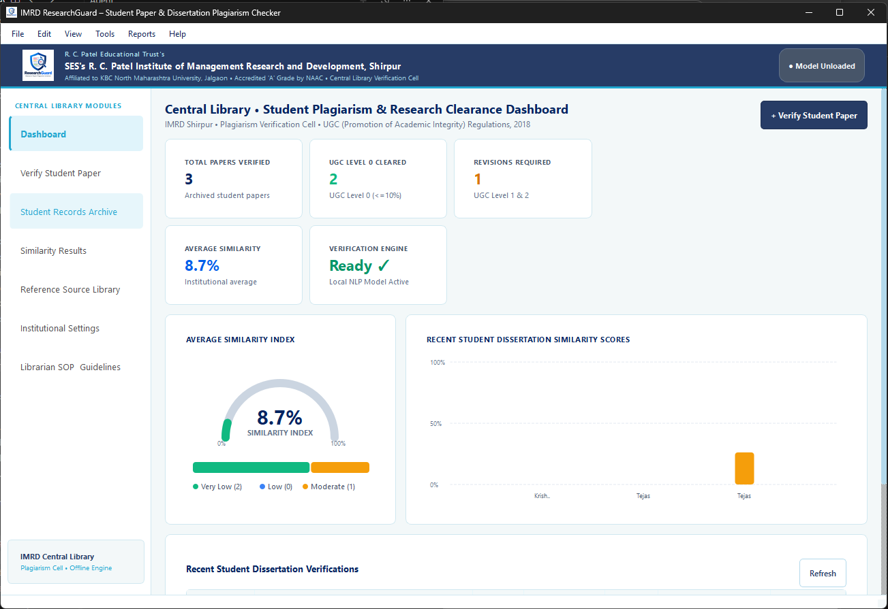
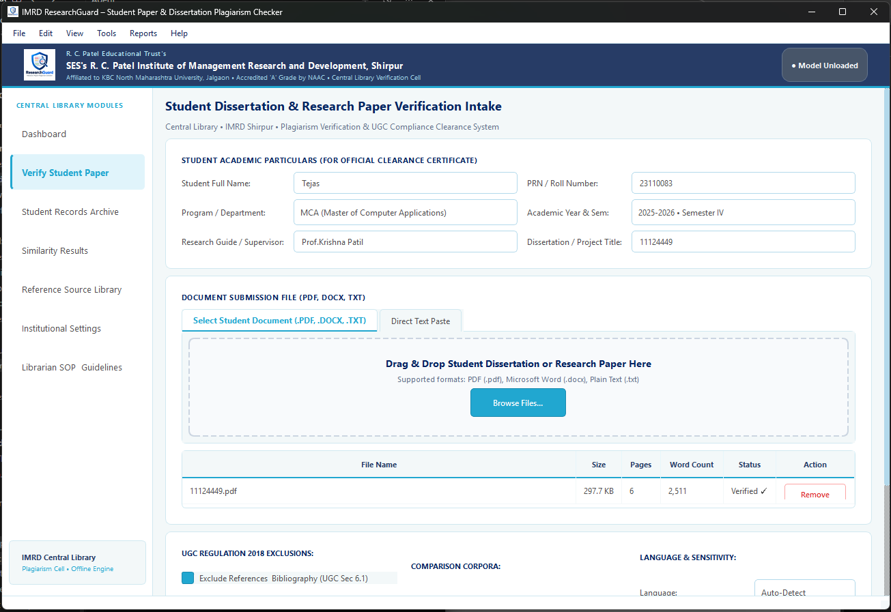
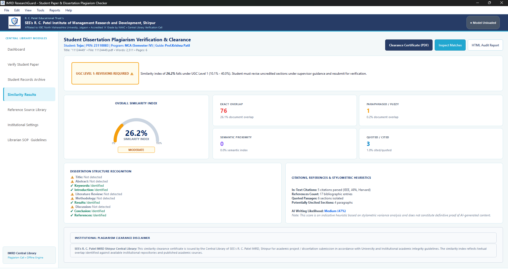
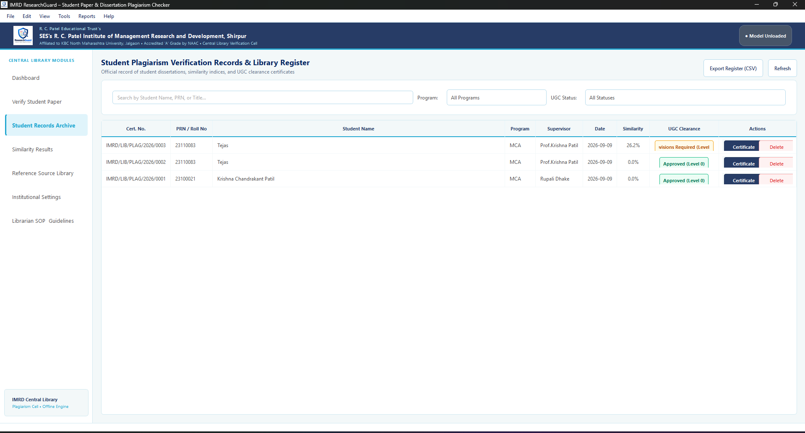
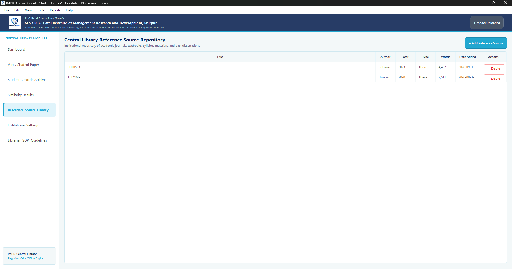
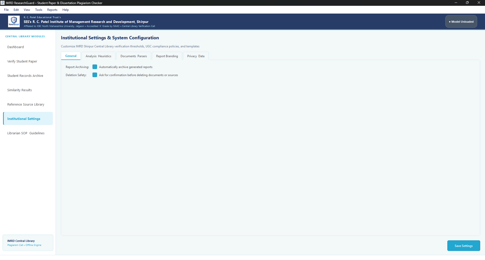
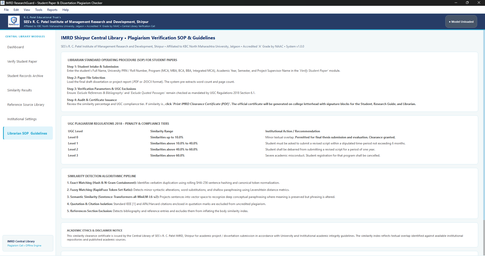
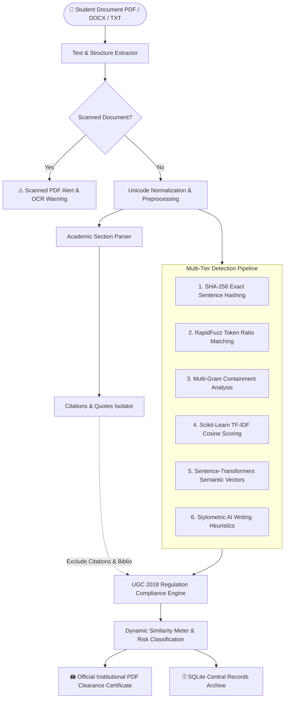

<div align="center">

  

  # 🛡️ ResearchGuard
  ### **Next-Gen Academic Plagiarism Detection & Research Clearance System**
  
  *Engineered for Central Libraries, Academic Institutions & Research Cells*  
  **Affiliated to SES's R. C. Patel Institute of Management Research & Development (IMRD), Shirpur**

  <p align="center">
    <a href="#-key-features"></a>
    <a href="#-technology-stack"></a>
    <a href="#-technology-stack"></a>
    <a href="#-ugc-regulations-2018-compliance-matrix"></a>
    <a href="#-installation--usage"></a>
  </p>

  <p align="center">
    <b>Offline-First Local Intelligence</b> • 
    <b>Multi-Tier Similarity Engine</b> • 
    <b>Stylometric AI Detection</b> • 
    <b>Official UGC Certificate Export</b>
  </p>

  <p align="center">
    <a href="#-interface-walkthrough--visual-showcase">View Gallery</a> •
    <a href="#-multi-stage-algorithmic-pipeline">Architecture</a> •
    <a href="#-ugc-regulations-2018-compliance-matrix">UGC Tiers</a> •
    <a href="#-installation--usage">Quickstart</a> •
    <a href="#-institution-credits">Credits</a>
  </p>

  <hr style="border: 0; height: 2px; background: linear-gradient(to right, rgba(0, 102, 204, 0), rgba(0, 102, 204, 0.75), rgba(0, 102, 204, 0));" />
</div>

<br/>

## 🌟 Executive Overview

**ResearchGuard** is a state-of-the-art Windows desktop application developed for university libraries, dissertation clearance cells, and academic research directors. Designed specifically to streamline compliance with the **UGC (Promotion of Academic Integrity and Prevention of Plagiarism in Higher Educational Institutions) Regulations, 2018**, ResearchGuard conducts multi-dimensional similarity analysis across research dissertations, master's theses, and conference papers.

Operating **completely offline** with an embedded high-speed natural language processing pipeline, ResearchGuard ensures **100% intellectual property confidentiality**—no student work is ever uploaded to third-party servers.

---

## 📸 Interface Walkthrough & Visual Showcase

Experience the fluid, modern interface built with PySide6 vector-rendered charts, responsive layouts, and glassmorphic UI elements.

<br/>

### 1️⃣ Central Library • Executive Plagiarism Clearance Dashboard
> High-level institutional clearance telemetry featuring live KPIs, active NLP engine status, recent dissertation clearance cards, and real-time similarity gauge meters.

<div align="center">
  
</div>

<br/>

---

### 2️⃣ Student Dissertation & Research Paper Verification Intake
> Modern drag-and-drop submission intake capturing student academic particulars (PRN/Roll No., Program, Research Guide), document pre-validation (pages, words, format), and granular UGC Regulation Section 6.1 exclusions.

<div align="center">
  
</div>

<br/>

---

### 3️⃣ Multi-Dimensional Similarity & Stylometric Analysis Engine
> Comprehensive forensic clearance results featuring vector similarity gauges, exact vs. paraphrased vs. semantic matching breakdown, dissertation structural recognition, and stylometric AI-generated content probability indicators.

<div align="center">
  
</div>

<br/>

---

### 4️⃣ Institutional Records Archive & Central Library Register
> Searchable, filterable audit register tracking all issued certificates, similarity percentages, UGC clearance levels, and instant PDF clearance certificate printing.

<div align="center">
  
</div>

<br/>

---

### 5️⃣ Reference Source Repository & Institutional Corpus
> Central institutional repository of published dissertations, reference textbooks, and journal articles against which new student submissions are matched.

<div align="center">
  
</div>

<br/>

---

### 6️⃣ Institutional Settings & Heuristics Configuration
> Fully customizable system parameters for analysis heuristics, parser configurations, report branding headers, and institutional privacy policies.

<div align="center">
  
</div>

<br/>

---

### 7️⃣ Librarian SOP & UGC 2018 Regulatory Guidelines
> Built-in reference manual documenting official Standard Operating Procedures (SOP), penalty thresholds, and ethical guidelines for verification officers.

<div align="center">
  
</div>

<br/>

---

## ⚡ Key Features

<table>
  <tr>
    <td width="50%" valign="top">
      <h3>🛡️ UGC 2018 Regulation Compliance</h3>
      <ul>
        <li><b>Automated Tier Classification</b>: Instant categorization into Level 0 (&le;10%), Level 1 (10-40%), Level 2 (40-60%), and Level 3 (&gt;60%).</li>
        <li><b>Section 6.1 Exclusions</b>: Configurable automated exclusion of bibliographies, cited quotations, generic terminology, and mathematical formulas.</li>
        <li><b>Official Clearance Certificates</b>: Print tamper-evident PDF certificates on institutional letterhead with verification serials.</li>
      </ul>
    </td>
    <td width="50%" valign="top">
      <h3>🧠 5-Tier Algorithmic Matching</h3>
      <ul>
        <li><b>Exact Overlap</b>: Rolling SHA-256 sentence hashing and n-gram containment for verbatim plagiarism detection.</li>
        <li><b>Fuzzy Matching</b>: RapidFuzz Levenshtein token sorting for syntactic manipulation and synonym replacement.</li>
        <li><b>Semantic NLP</b>: Deep sentence-transformer embeddings (<code>all-MiniLM-L6-v2</code>) detecting conceptual rewriting.</li>
      </ul>
    </td>
  </tr>
  <tr>
    <td width="50%" valign="top">
      <h3>🤖 Stylometric AI Writing Detection</h3>
      <ul>
        <li><b>Perplexity & Burstiness Analysis</b>: Evaluates variance in sentence structures and syntactic rhythm.</li>
        <li><b>Type-Token Ratio (TTR)</b>: Lexical diversity heuristics indicating machine-generated patterns.</li>
        <li><b>Indicative Probabilities</b>: Transparent low/medium/high scoring with clear disclaimers.</li>
      </ul>
    </td>
    <td width="50%" valign="top">
      <h3>🔒 Air-Gapped & Secure</h3>
      <ul>
        <li><b>100% Offline Capability</b>: Embedded SQLite database with zero external API calls needed during core analysis.</li>
        <li><b>Local Data Sovereignty</b>: Student documents remain strictly on the local machine or campus intranet.</li>
        <li><b>Multi-Format Support</b>: Native high-speed parsing for <code>PDF</code> (PyMuPDF), <code>DOCX</code>, and <code>TXT</code>.</li>
      </ul>
    </td>
  </tr>
</table>

<br/>

---

## 🔬 Multi-Stage Algorithmic Pipeline



<br/>

---

## 🏛️ UGC Regulations 2018 Compliance Matrix

| UGC Compliance Tier | Similarity Index | Permitted Submission Status | Recommended Institutional Action |
| :---: | :---: | :---: | :--- |
|  | **0.0% – 10.0%** | **Approved for Final Defense** | Minor natural overlap. Formal Institutional Clearance Certificate issued immediately. |
|  | **10.1% – 40.0%** | **Revisions Required** | Student must revise uncredited sections under supervisor guidance and resubmit within 6 months. |
|  | **40.1% – 60.0%** | **Temporary Debarment** | Script rejected. Student debarred from submitting revised dissertation for a period of one full year. |
|  | **> 60.0%** | **Registration Revoked** | Severe academic misconduct. Student registration for the academic degree program cancelled. |

<br/>

---

## 💻 Technology Stack

<div align="center">
  <table>
    <thead>
      <tr>
        <th>Layer</th>
        <th>Technologies & Libraries</th>
        <th>Purpose</th>
      </tr>
    </thead>
    <tbody>
      <tr>
        <td><b>Desktop Interface</b></td>
        <td><code>PySide6 (Qt 6.6+)</code>, <code>QPainter</code> vector graphics</td>
        <td>Hardware-accelerated native Windows GUI, gauges, and interactive dashboards</td>
      </tr>
      <tr>
        <td><b>Document Parsers</b></td>
        <td><code>PyMuPDF (fitz)</code>, <code>python-docx</code>, <code>Pillow</code></td>
        <td>High-fidelity text extraction, scanned page detection, and metadata analysis</td>
      </tr>
      <tr>
        <td><b>Similarity Engines</b></td>
        <td><code>RapidFuzz</code>, <code>scikit-learn</code>, <code>NumPy</code></td>
        <td>Levenshtein metrics, TF-IDF vectorizers, and n-gram containment matrix</td>
      </tr>
      <tr>
        <td><b>Deep Semantic NLP</b></td>
        <td><code>sentence-transformers</code> (<code>all-MiniLM-L6-v2</code>)</td>
        <td>Paraphrase detection via high-dimensional semantic embedding space</td>
      </tr>
      <tr>
        <td><b>Report Generation</b></td>
        <td><code>ReportLab 4.1+</code>, <code>HTML5</code></td>
        <td>High-resolution PDF clearance certificates with QR/barcodes and colorized audit reports</td>
      </tr>
      <tr>
        <td><b>Persistence Layer</b></td>
        <td><code>SQLAlchemy 2.0+</code>, <code>SQLite3</code></td>
        <td>ACID-compliant institutional records repository and reference corpus catalog</td>
      </tr>
      <tr>
        <td><b>Distribution</b></td>
        <td><code>PyInstaller 6.5+</code>, <code>Inno Setup 6</code></td>
        <td>Single-file / directory standalone Windows 64-bit installer with bundled runtimes</td>
      </tr>
    </tbody>
  </table>
</div>

<br/>

---

## 🚀 Installation & Usage

### Option A: Running from Source (Developer Setup)

1. **Clone the Repository**:
   ```bash
   git clone https://github.com/kriss2012/Plagiarism-Checker.git
   cd Plagiarism-Checker
   ```

2. **Create a Virtual Environment**:
   ```bash
   python -m venv venv
   .\venv\Scripts\activate
   ```

3. **Install Dependencies**:
   ```bash
   pip install -r requirements.txt
   ```

4. **Launch ResearchGuard**:
   ```bash
   python -m app.main
   ```

<br/>

### Option B: Compiling Standalone Windows Executable (.EXE)

Build a self-contained `.exe` without requiring Python on target library workstations:

```powershell
python build_exe.py
```

The output will be packaged in:
```plaintext
dist/
└── ResearchGuard/
    ├── ResearchGuard.exe    # Standalone 64-bit Windows Application
    ├── resources/           # Assets, Icons, and Watermarks
    └── Logo.png             # Institutional Logo
```

<br/>

---

## 📂 Project Directory Structure

```plaintext
Plagiarism-Checker/
├── Logo.png                   # High-resolution application branding logo
├── requirements.txt           # Production Python dependencies
├── build_exe.py               # Automated PyInstaller compilation pipeline
├── ResearchGuard.spec         # PyInstaller runtime packaging spec
├── installer.iss              # Inno Setup Windows installer configuration
├── Images/                    # High-DPI interface showcase screenshots
│   ├── dashboard_overview.png
│   ├── verification_intake.png
│   ├── similarity_results.png
│   ├── records_archive.png
│   ├── source_library.png
│   ├── system_settings.png
│   └── librarian_sop.png
├── app/
│   ├── main.py                # Application entry point & Qt event loop
│   ├── config.py              # Application settings, themes & constants
│   ├── core/                  # Extraction, segmentation, citations & engine
│   ├── database/              # SQLAlchemy schema models & SQLite session
│   ├── ml/                    # Sentence transformer semantic embeddings
│   ├── reports/               # ReportLab PDF & HTML certificate generators
│   └── ui/                    # PySide6 custom views, widgets, and themes
└── resources/                 # Application icons, splash art, and samples
```

<br/>

---

## 🏛️ Institution & Development Credits

<div align="center">
  <p><b>Developed for Central Library Plagiarism Verification Cell</b></p>
  <h3>SES's R. C. Patel Institute of Management Research and Development (IMRD)</h3>
  <p><i>Affiliated to Kavayitri Bahinabai Chaudhari North Maharashtra University, Jalgaon</i><br/>
  <b>Accredited 'A' Grade by NAAC</b> • Shirpur, Maharashtra, India</p>

  <br/>

  <sub>ResearchGuard adheres strictly to academic integrity standards set forth by the University Grants Commission (UGC) of India.</sub>
</div>
